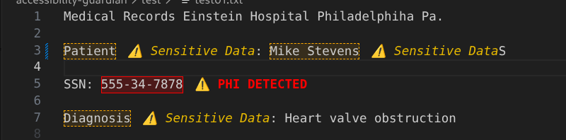
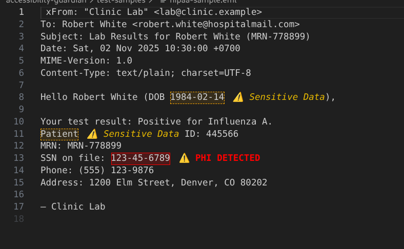
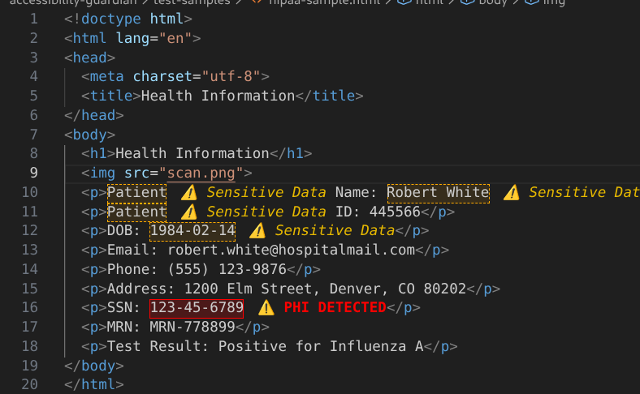
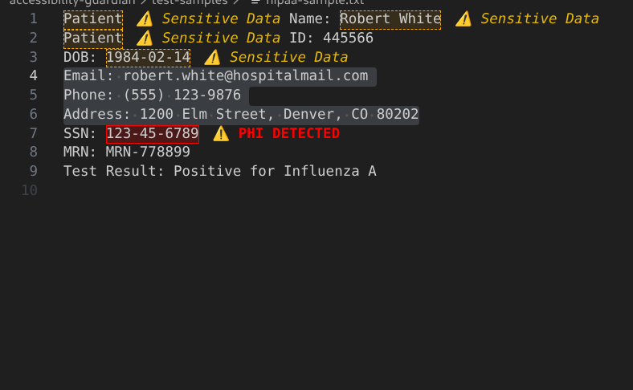

# Accessibility Guardian

Developer-first accessibility and compliance scanning for VS Code.

Accessibility Guardian helps developers detect accessibility and compliance issues directly inside the editor while writing code.

Instead of waiting for audits or external scanners, teams can catch problems earlier in the development workflow.

## What It Does

Accessibility Guardian analyzes project files for common accessibility and compliance risks, including WCAG/ADA-related patterns and optional privacy/compliance checks.

## Key Features

- Real-time accessibility diagnostics
- Local-first scanning workflow
- Workspace deep scan across multiple files
- VS Code Problems panel integration for fast remediation

## Example Issues Detected

Accessibility Guardian can identify issues such as:

- Images missing `alt` attributes
- Incorrect ARIA roles or attributes
- Semantic HTML structure issues
- Improper heading hierarchy
- Non-semantic accessibility anti-patterns

## Why It Exists

Accessibility issues are often introduced unintentionally during development. Accessibility Guardian is designed to shift detection left, so teams can fix issues before QA bottlenecks or post-release remediation.

## Installation

Install from the VS Code Marketplace:

<https://marketplace.visualstudio.com/items?itemName=EchoCoreLabs.accessibility-guardian>

Then open Command Palette and run:

- `Accessibility Guardian: Scan Active File`
- `Accessibility Guardian: Deep Scan Workspace (PDF/DOCX)`

## Usage

Run scans from Command Palette:

- Scan Active File
- Deep Scan Workspace

Diagnostics appear directly in the VS Code Problems panel.

## Screenshots

> Note: screenshots use synthetic demo data for illustration.

## Configuration

Configure via VS Code settings:

- `accessibilityGuardian.enableHipaa`
- `accessibilityGuardian.privacy.crossBorder.enabled`
- `accessibilityGuardian.privacy.crossBorder.highRiskVendors`
- `accessibilityGuardian.privacy.crossBorder.requireTransferMechanismDisclosure`
- `accessibilityGuardian.privacy.crossBorder.requireSCCorAdequacyMention`
- `accessibilityGuardian.privacy.crossBorder.requireDPAControllerProcessorLanguage`
- `accessibilityGuardian.privacy.crossBorder.severity`
- `accessibilityGuardian.privacy.highRiskVendors`
- `accessibilityGuardian.privacy.complianceKeywords`

Workspace overrides (optional): `.accessibility-guardian.json`

## Roadmap

Planned improvements include:

- Expanded accessibility rule coverage
- Improved accessibility heuristics
- Deeper project-level analysis
- Better diagnostics and quick-fix guidance

## Launch Assets

- Demo script: `docs/DEMO_SCRIPT_5_MIN.md`
- Screenshot shotlist: `docs/MARKETPLACE_SCREENSHOT_SHOTLIST.md`
- 30-day install sprint: `docs/LAUNCH_SPRINT_30_DAYS.md`

## License

MIT License
